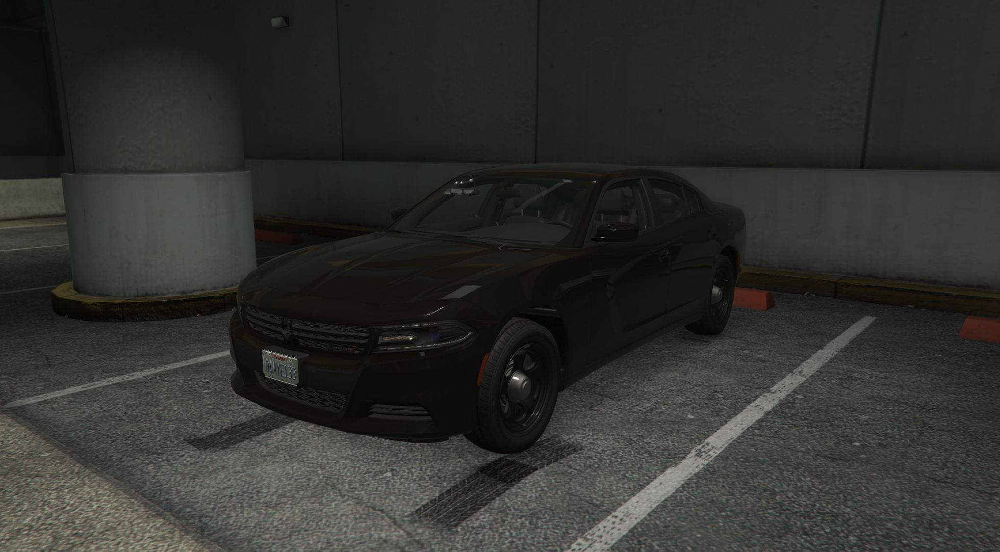
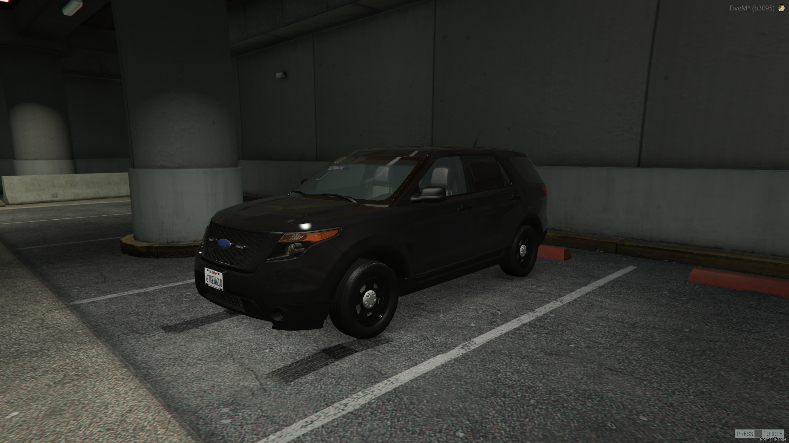
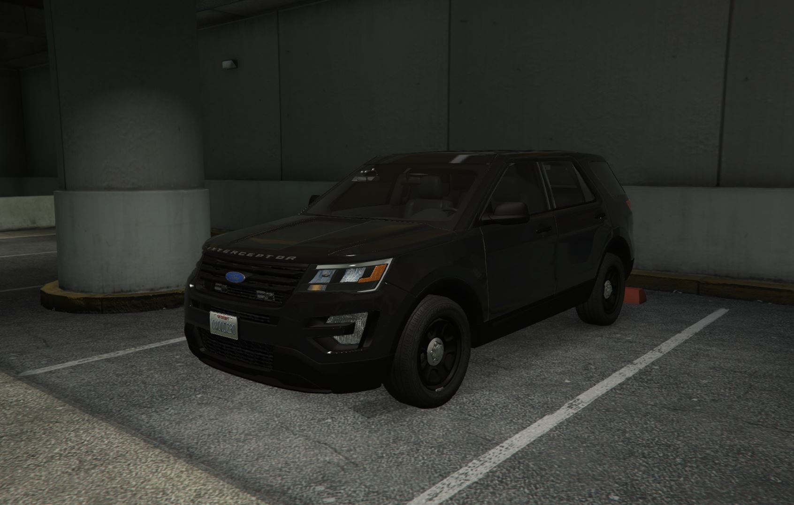
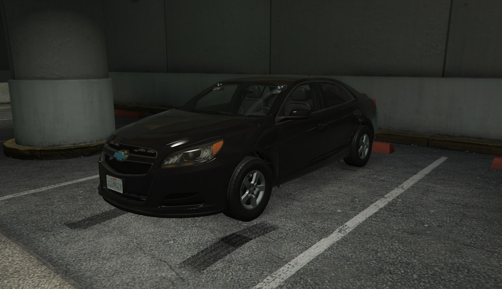
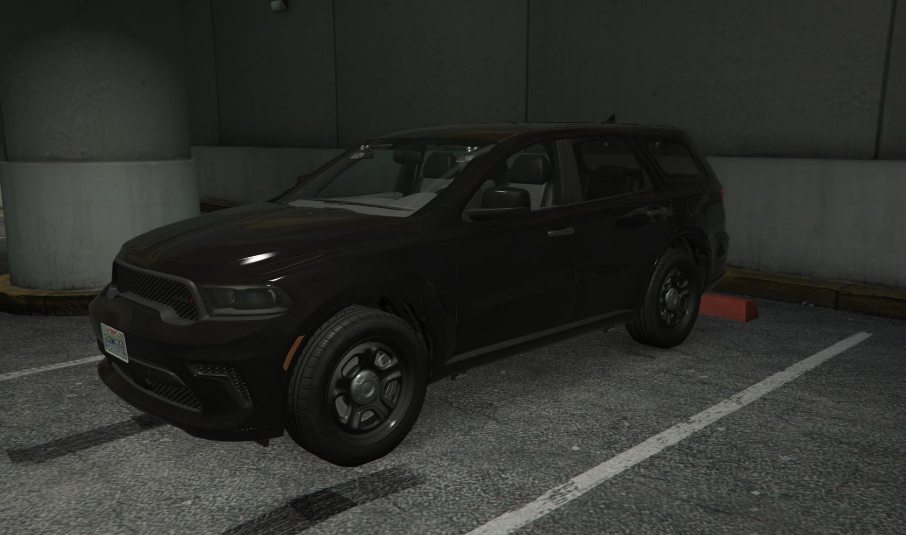
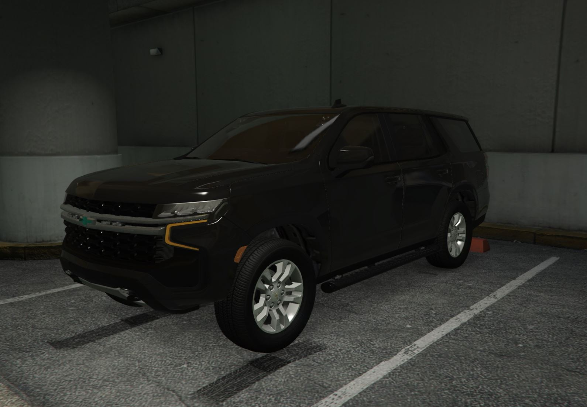

# FIB

## About

**The Federal Investigation Bureau is the domestic intelligence and security service of the United States and its principal federal law enforcement agency.**

## Headquarters

<figure><figcaption>
Nearest Postal: 8031
</figcaption></figure>

## Vehicles

The Federal Investigation Bureau vehicle fleet is currently 6 strong, all vehicles are unmarked currently and the colors can be decided by whatever the player chooses.

The following FIB vehicles have an integrated script for their lights which allows players to set a lighting pattern for certain lights on the vehicle, these are toggled via numbers 1, 2 and 3 on your keyboard.\
Vehicles included with script: Malibu, Durango & 22 Tahoe

<figure><figcaption>
fbi4
</figcaption></figure>

 

<figure><figcaption>
fbi5
</figcaption></figure>

 

<figure><figcaption>
fbi6
</figcaption></figure>

 

<figure><figcaption>
fbimalibu
</figcaption></figure>

 

<figure><figcaption>
fbidurango
</figcaption></figure>

 

<figure><figcaption>
fbi22tahoe
</figcaption></figure>

