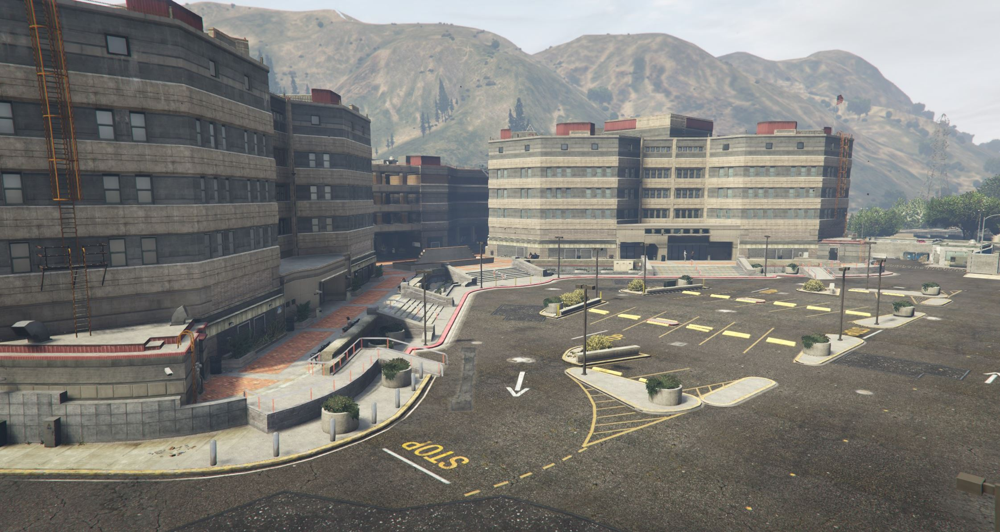

# NOOSE


Application Status: CLOSED


## About

**The National Office of Security Enforcement is a federal executive department of the United States government, housing the branches of Patriotism and Immigration Authority, Border Patrol & Security Enforcement Police.**

## Headquarters

<figure><figcaption>
Substancia Road - Nearest Postal: 9393
</figcaption></figure>
