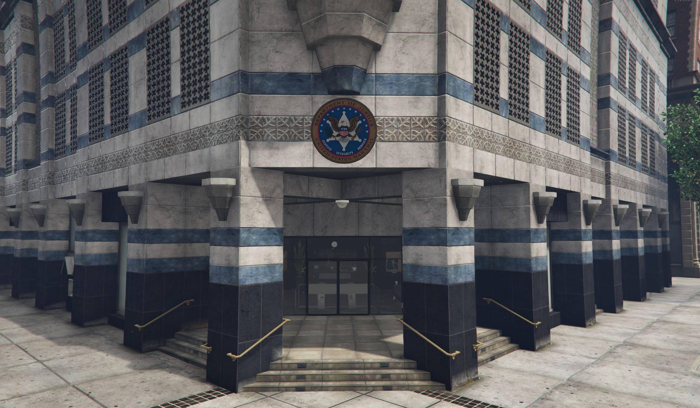

# USMS


Application Status: CLOSED


## About

**The United States Marshals Service is a federal law enforcement agency in the United States. The Marshals Service serves as the enforcement and security arm of the U.S. federal judiciary, although it is an agency of the U.S. Department of Justice and operates under the direction of the U.S. Attorney General.**

## Headquarters

<figure><figcaption>
Nearest Postal: 8057
</figcaption></figure>
