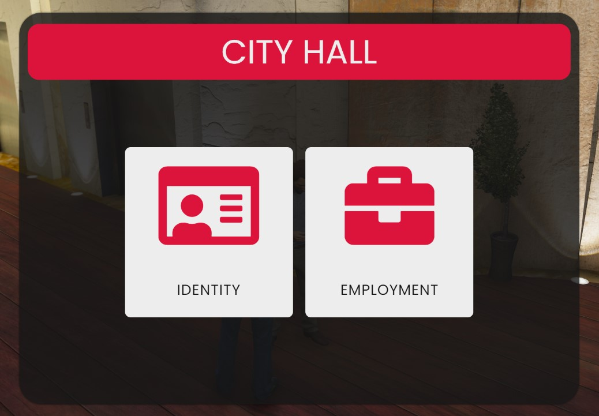

# Employment

### Beginning Your Career

Upon joining **Vanguard RP** you will be unemployed with 2 basic items, an **ID Card** and a **Phone** and if you wish to further progress in the game you will need to choose wisely between either getting a legitimate job or living a life of crime.  &#x20;

If you wish to get employed from the start then you will first need to make your way to the **City Hall** where you will find the NPC you need to speak to.


_To easily find the **City Hall** you can use the chat command **/postal 8155** which will then give you the direct waypoint._


<figure><figcaption>
<em>NPC at the City Hall.</em>
</figcaption></figure>

Upon speaking to the NPC you will be given two options, (**Identity**) and (**Employment**). Identity is where you will get your ID Card & Licenses if you were to lose them or have been granted new ones.

<figure><figcaption>
<em>City Hall NPC Options.</em>
</figcaption></figure>

Employment is the option you should choose right now. As shown below you will be given a list of available jobs you can apply for (_Police & EMS are whitelisted jobs only_).

<figure><figcaption>
<em>Available Employment Options.</em>
</figcaption></figure>

### Employment Options

* [Bus Driver](bus-driver.md)
* [Car Dealer](car-dealer.md)
* [Cleaner](cleaner.md)
* [EMS](ems.md)
* [Garbage Collector](garbage-collector.md)
* [Hot Dog Seller](hot-dog-stand.md)
* [Lawyer](lawyer.md)
* [Law Enforcement](law-enforcement/)
* [Mechanic](mechanic.md)
* [News Reporter](news-reporter.md)
* [Parking Enforcer](parking-enforcer.md)
* [Real Estate](real-estate.md)
* [Security Sector](security-sector.md)
* [Taxi Driver](taxi.md)
* [Tow Truck](tow-truck.md)
* [Trucker](trucker.md)
