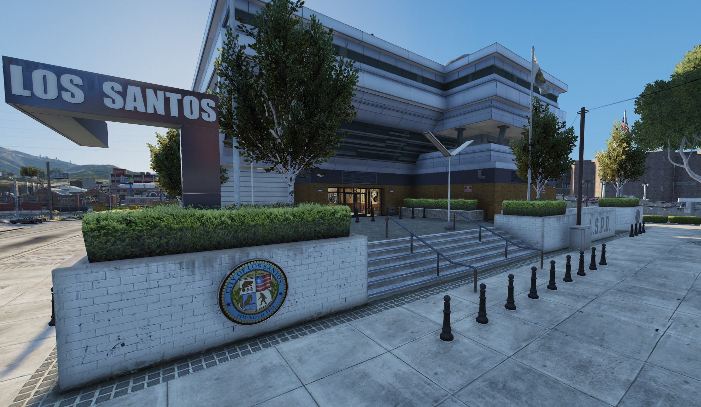

# Branches

**Los Santos Police Department (LSPD)**


**Whitelisted** (Postal /8047)


The Los Santos Police Department is there to protect and serve the citizens of Los Santos.

[Apply Today](https://discord.gg/Vgmmt3C)

**Station(s):**

<figure><figcaption>
Mission Row Police Department
</figcaption></figure>

**Specialist Divisions**

* Traffic Enforcement
* Canine
* Criminal Investigation Department
* Gang Enforcement Detail
* Aerial Operations
* METRO
* Special Weapons & Tactics

***

**Blaine Country Sheriff's Office (BCSO)**


**Whitelisted** (Postal /0000)


The Blaine County Sheriff's Office is there to protect and serve the citizens of Sandy Shores, Paleto Bay, and the greater Blaine County area.

[Apply Today](https://discord.gg/Vgmmt3C)

**Station(s):**

Sandy Shores Sheriff's Station

< IMAGE HERE >

**Specialist Divisions**

* Motorcycle Division
* Canine
* Criminal Investigation Department
* Task Force
* Harbor Patrol
* Winged Division
* Search & Rescue
* Special Weapons & Tactics

***

**San Andreas Highway Patrol (SAHP)**


**Whitelisted** (Postal /0000)


The San Andreas Highway Patrol is a specialized service there to enforce the law and protect the public on the roads of San Andreas.

[Apply Today](https://discord.gg/Vgmmt3C)

**Station(s):**

TBC

< IMAGE HERE >

**Specialist Divisions**

* Motorcycle Division
* Canine
* Criminal Investigation Department
* Commercial Vehicle Service
* Rotary Division
* Special Weapons & Tactics

***
