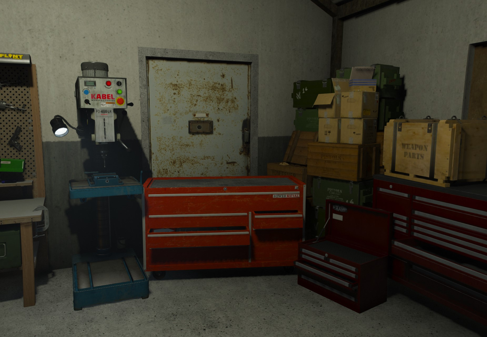

# Weapon Serial Scratching

If you have a weapon that has been used in an illegal activity such as a murder or robbery of some kind then you can make it harder for the (Law Enforcement) to know you were involved by scratching off the weapon serial. There is a location shown below where if you go there then you can do such for a small fee and as long as you have the right tool.

<figure><figcaption></figcaption></figure>

To get to the location you can use any of the 3 postal's by using /postal in the chat then followed by one of the following: (9357, 9358, or 9359) to put the marker on the map for you to find it easily.

<figure><figcaption></figcaption></figure>
