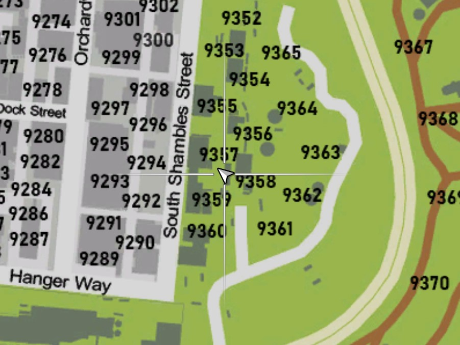

# Weapon Serial Scratching

If you have a weapon that has been used in an illegal activity such as a murder or robbery of some kind then you can make it harder for the (Law Enforcement) to know you were involved by scratching off the weapon serial. There is a location shown below where if you go there then you can do such for a fee.

<figure><figcaption></figcaption></figure>


_To easily find the **Weapon Serial Scratching** location you can use the chat command **/postal 8181** which will then give you the direct waypoint._


To be able to complete the weapon scratch you will need a (Steel File) tool which can be found at the hardware store.

<figure><figcaption></figcaption></figure>
