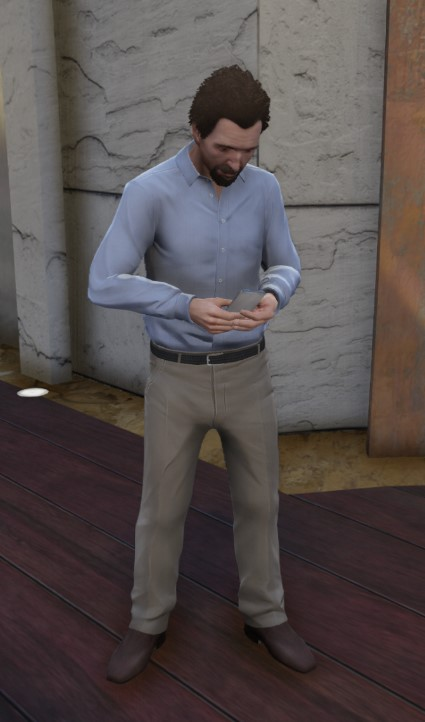

# Employment

### Beginning Your Career

Upon joining Vanguard RP you will be unemployed with 2 basic items, an ID Card and a Phone and if you wish to further progress in the game you will need to choose wisely between either getting a legitimate job or living a life of crime.  &#x20;

If you wish to get employed from the start then you will first need to make your way to the City Hall where you will find the NPC you need to speak to.


To easily find the City Hall you can /postal 8155 which will give you the waypoint.


<figure><figcaption>
NPC at the City Hall.
</figcaption></figure>

Upon speaking to the NPC you will be given two options, (Identity) and (Employment). Identity is where you will get your ID Card & Licenses if you were to lose them or have been granted new ones.

<figure><figcaption>
City Hall NPC Options.
</figcaption></figure>

Employment is the option you should choose right now. As shown below you will be given a list of available jobs you can apply for (Police & EMS are whitelisted jobs only).

<figure><figcaption>
Availble Eploment Options.
</figcaption></figure>

### Employment Options

* [Bus Driver](bus-driver.md)
* [Car Dealer](bus-driver-1.md)
* [Cleaner](bus-driver-2.md)
* [EMS](ems.md)
* [Garbage Collector](garbage-collector.md)
* [Hot Dog Seller](hot-dog-stand.md)
* [Lawyer](hot-dog-stand-1.md)
* [Mechanic](bus-driver-3.md)
* [News Reporter](news-reporter.md)
* [Parking Enforcer](news-reporter-1.md)
* [Police](police/)[ Officer](police/)
* [Real Estate](news-reporter-2.md)
* [Taxi Driver](taxi.md)
* [Tow Truck](tow-truck.md)
* [Trucker](trucker.md)
