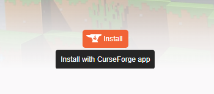
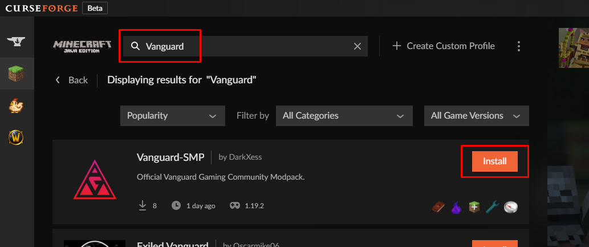

# Minecraft

<figure><figcaption></figcaption></figure>


**Current Version Info** - Minecraft: <mark style="color:yellow;">1.20.1</mark> | Forge: <mark style="color:yellow;">47.2.0</mark> | ModPack: <mark style="color:yellow;">0.1.7</mark>


### Getting Started

To connect to our Minecraft server you will first have to update your Minecraft to the version that our server is currently using, this can be done through the Minecraft launcher. Then you will need to download the correct ModPack & Forge versions that we are currently using, there are two ways you can do this, either manually or automatically.

**Manually**: Download the correct [Forge](https://adfoc.us/serve/?id=27122897707125) & [ModPack](https://www.mediafire.com/file/ktss4h5lfnw5060/Vanguard-SMP-0.1.7.zip/file) version(s) we are using specifically the one stated in the _(Current Version Info)_ above or it will not work. Install Forge as you would do usually, double click, and let it do its thing, once that is done download the ModPack and put the "mods" folder inside of your main Minecraft directory, overwrite if asked to do so.

**Automatically**: Download the [CurseForge App](https://download.curseforge.com/) which will update your Minecraft, Forge, and our ModPack automatically. Once you have installed the CurseForge App you can download our ModPack which can be found on CurseForge [here](https://legacy.curseforge.com/minecraft/modpacks/vanguard-smp).

When you have found our ModPack on CurseForge look towards the right and you will see an Install button _(as shown below)_ which will connect to your CurseForge App and install it automatically.

<figure><figcaption></figcaption></figure>

Or simply through the CurseForge App, by searching for "Vanguard", and when you find our ModPack press the install button _(as shown below)_ and it will do everything for you. Once that is complete press play and then refer to the information below for connecting to our server.

<figure><figcaption></figcaption></figure>

### Server Information

When you first open the game, click on (**Multiplayer**) and then (**Add Server**). Under where it says (**Server Name**) you can put what you want here, I will use (**Vanguard Server**) for example, then on the second line (**Server Address**), you can put our domain (**vgnserver.xyz**) as shown below.

<figure><figcaption></figcaption></figure>

### ModPack Information

This pack is still a work in progress and as such is unfinished. We're constantly working on and looking for mods that would work well with the style that we're trying to achieve while trying to balance out what's already there. While we're also more than happy to take suggestions from our community.


_When either Minecraft, Forge, or our ModPack are updated we shall mention so within our Discord under the Minecraft discord channel._


### Shaders

If you wish to use the Shaders that come with the Modpack then you are going to have to download **Optifine** which is a client-side mod. Download the recommended version that our server accepts right [here](https://optifine.net/downloads). Upon downloading that file move head over to your Minecraft directory and place it inside of your mods folder, then you should be good to go. When you are in-game just open your video settings and load your chosen shaders.&#x20;

_We highly recommend the (_**Complementary Shaders**_) pack._
